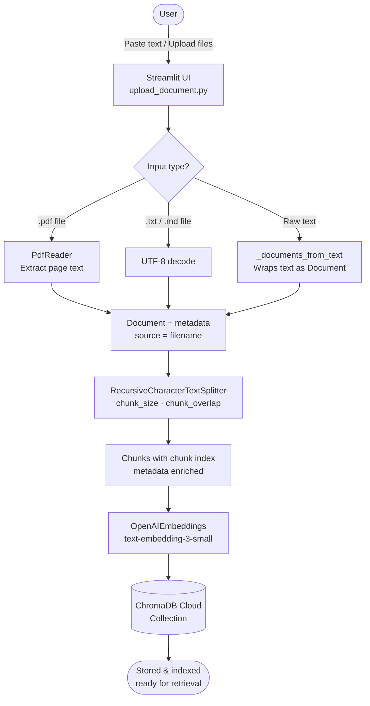
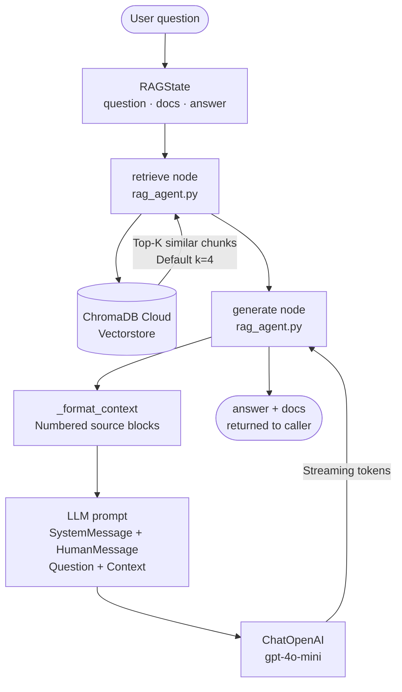
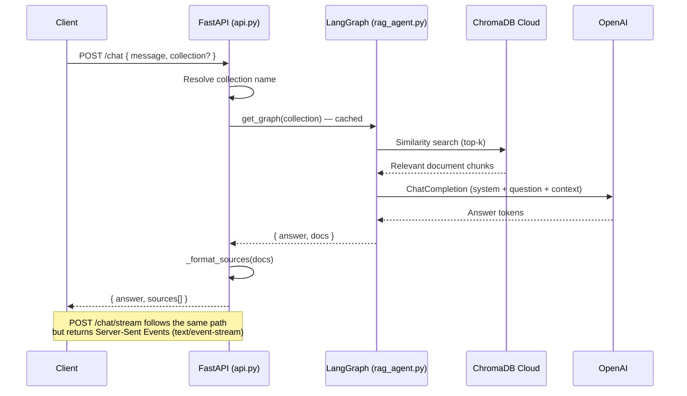

# ChromaDB Cloud + LangGraph RAG Demo

A full-stack RAG (Retrieval-Augmented Generation) application built with **FastAPI**, **LangGraph**, **LangChain**, **ChromaDB Cloud**, and **OpenAI**. Includes a Streamlit UI for ingesting documents and a REST API for querying them.

---

## Project Structure

```
ChromaDB Demo/
├── chroma_client.py       # Shared singletons: ChromaDB Cloud, OpenAI embeddings & LLM
├── upload_document.py     # Streamlit UI — ingest documents into ChromaDB
├── api.py                 # FastAPI server — /chat and /chat/stream endpoints
├── rag_agent.py           # LangGraph StateGraph — retrieve → generate pipeline
├── requirements.txt       # Python dependencies
└── README.md
```

---

## What is ChromaDB?

[ChromaDB](https://www.trychroma.com/) is an open-source vector database designed for AI applications. It stores document embeddings and supports fast similarity search, making it ideal for RAG pipelines.

**ChromaDB Cloud** is the hosted version — no local server required. You connect via an API key, tenant, and database identifier obtained from the [Chroma Dashboard](https://www.trychroma.com/).

---

## Prerequisites

- Python 3.10+
- A [ChromaDB Cloud](https://www.trychroma.com/) account
- An [OpenAI](https://platform.openai.com/) API key

---

## Setup

### 1. Clone / navigate to the project

```bash
cd "ChromaDB Demo"
```

### 2. Create and activate a virtual environment

```bash
python -m venv .venv
source .venv/bin/activate        # macOS / Linux
.venv\Scripts\activate           # Windows
```

### 3. Install dependencies

```bash
pip install -r requirements.txt
```

### 4. Configure environment variables

Copy the root `.env.example` to a `.env` file inside the project root and fill in your credentials:

```bash
cp ../.env.example ../.env
```

Then edit `.env`:

```env
OPENAI_API_KEY=sk-...           # Required — used for embeddings & LLM
CHROMA_API_KEY=...              # From ChromaDB Cloud dashboard
CHROMA_TENANT=...               # Your ChromaDB tenant ID
CHROMA_DATABASE=...             # Your ChromaDB database name
```

**Optional overrides:**

| Variable                  | Default                  | Description                          |
|---------------------------|--------------------------|--------------------------------------|
| `CHROMA_COLLECTION`       | `edureka-session-demo`   | Default collection name              |
| `CHROMA_TOP_K`            | `4`                      | Number of results returned per query |
| `OPENAI_EMBEDDINGS_MODEL` | `text-embedding-3-small` | OpenAI embedding model               |
| `OPENAI_MODEL`            | `gpt-4o-mini`            | OpenAI chat model                    |

---

## Running the Apps

### Ingest UI (Streamlit)

```bash
streamlit run upload_document.py
```

Opens at `http://localhost:8501`.

### RAG API (FastAPI)

```bash
uvicorn api:app --reload
```

Opens at `http://localhost:8000`. Interactive docs at `http://localhost:8000/docs`.

---

## Using the Ingest UI

1. **Sidebar** — set the collection name and chunking parameters:
   - **Chunk size**: characters per chunk (default 900)
   - **Chunk overlap**: overlap between consecutive chunks (default 150)
2. **Paste text** — enter a source label and paste raw content directly.
3. **Upload files** — upload one or more `.txt`, `.md`, or `.pdf` files.
4. Click **Ingest into Chroma** to split documents into chunks and store them.
5. Expand **Preview chunks** to inspect the first 5 ingested chunks.

---

## API Endpoints

| Method | Path           | Description                              |
|--------|----------------|------------------------------------------|
| GET    | `/`            | Health check                             |
| POST   | `/chat`        | Blocking RAG query — returns full answer |
| POST   | `/chat/stream` | Streaming RAG query — Server-Sent Events |

### `/chat` request body

```json
{
  "message": "What is LangGraph?",
  "collection": "edureka-session-demo"
}
```

### `/chat` response

```json
{
  "answer": "LangGraph is ...",
  "sources": [
    { "source": "langchain-docs.pdf", "chunk": 3, "id": null }
  ]
}
```

### `/chat/stream` SSE events

```
data: {"type": "token", "content": "Lang"}
data: {"type": "token", "content": "Graph"}
...
data: [DONE]
```

---

## Architecture Diagrams

### 1. Storing Data in ChromaDB



---

### 2. RAG Pipeline — How It Works



---

### 3. API Request Flow



---

## How the LangGraph Pipeline Works

`rag_agent.py` builds a **LangGraph StateGraph** compiled once per collection (cached via `@lru_cache`):

```
START → retrieve → generate → END
```

| Node       | Input          | Action                                              | Output       |
|------------|----------------|-----------------------------------------------------|--------------|
| `retrieve` | `question`     | Similarity search on ChromaDB vectorstore           | `docs`       |
| `generate` | `question, docs` | Formats context → streams LLM response            | `answer`     |

The stream writer in the `generate` node emits `{"type": "token", "content": "..."}` events consumed by the `/chat/stream` SSE endpoint.

---

## Getting ChromaDB Cloud Credentials

1. Sign up at [https://www.trychroma.com/](https://www.trychroma.com/)
2. Create a **database** in your dashboard
3. Copy your **API key**, **tenant**, and **database** name into your `.env` file

---

## Dependencies

| Package                    | Purpose                              |
|----------------------------|--------------------------------------|
| `chromadb`                 | ChromaDB Cloud client                |
| `langchain-chroma`         | LangChain ↔ ChromaDB integration     |
| `langchain-openai`         | OpenAI embeddings & chat models      |
| `langchain-text-splitters` | Document chunking                    |
| `langgraph`                | StateGraph RAG pipeline              |
| `fastapi`                  | REST API server                      |
| `uvicorn`                  | ASGI server                          |
| `pypdf`                    | PDF text extraction                  |
| `streamlit`                | Ingest web UI                        |
| `python-dotenv`            | `.env` file loading                  |
